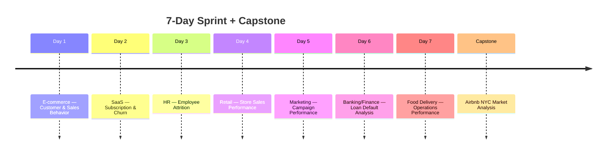

 

 

---

## 🧭 The Idea

> [!NOTE]
> Most portfolios explore **one dataset, ten different ways**. This project flips that: **one repeatable analytical process, applied to seven completely different industries** — each with its own data, stakeholders, and definition of "success." Then, to prove it all ties together, a **capstone project** brings the full lifecycle — business problem → cleaning → SQL → dashboard → recommendation — into one comprehensive, real-world engagement.

Every business — retail, SaaS, HR, banking, marketing, food delivery — sits on top of data it isn't fully using. Over 7 days, I picked a new industry each day, took a messy real-world dataset, and worked it end-to-end: raw rows → EDA → insight → a recommendation someone could actually act on. The **Capstone Project** then pulls those same skills into a single, larger-scale business analytics engagement.

---

## 🗺️ The Journey

```mermaid
flowchart LR
    A["📥 Raw Dataset"] --> B["🧹 Clean & Structure"]
    B --> C["🔎 Explore & Segment"]
    C --> D["📊 Analyze Drivers"]
    D --> E["💡 Business Insight"]
    E --> F["✅ Actionable Recommendation"]
    F --> G["🏆 Capstone Project"]

    style A fill:#1a1a2e,stroke:#00c6ff,color:#fff
    style B fill:#16213e,stroke:#00c6ff,color:#fff
    style C fill:#0f3460,stroke:#00c6ff,color:#fff
    style D fill:#16213e,stroke:#00c6ff,color:#fff
    style E fill:#1a1a2e,stroke:#ff6d00,color:#fff
    style F fill:#0f3460,stroke:#00c853,color:#fff
    style G fill:#6a1b9a,stroke:#ff6d00,color:#fff
```

---

## 📌 Project Directory

| # | Project | Business Question | Case Study |
|:-:|:---------|:-------------------|:-:|
| 🛒 **01** | E-commerce | Who are our most valuable customers? | [**Explore →**](https://github.com/SankalpSinghRanaut/30-Days-30-DA-Project-and-Case-Study/tree/main/Day%201%20%E2%80%94%20E-commerce%20Customer%20%26%20Sales%20Behavior) |
| 💻 **02** | SaaS | Why is growth slowing despite more signups? | [**Explore →**](https://github.com/SankalpSinghRanaut/30-Days-30-DA-Project-and-Case-Study/tree/main/Day%202%20%E2%80%94%20SaaS%20Subscription%20%26%20Churn) |
| 🧑‍💼 **03** | HR | Why are employees actually leaving? | [**Explore →**](https://github.com/SankalpSinghRanaut/30-Days-30-DA-Project-and-Case-Study/tree/main/Day%203%20%E2%80%94%20HR%20Employee%20Attrition) |
| 🏬 **04** | Retail | Are we chasing sales at the cost of profit? | [**Explore →**](https://github.com/SankalpSinghRanaut/30-Days-30-DA-Project-and-Case-Study/tree/main/Day%204%20%E2%80%94%20Retail%20Store%20Sales%20Performance) |
| 📣 **05** | Marketing | Which campaigns and segments drive ROI? | [**Explore →**](https://github.com/SankalpSinghRanaut/30-Days-30-DA-Project-and-Case-Study/tree/main/Day%205%20%E2%80%94%20Marketing%20Campaign%20Performance) |
| 🏦 **06** | Banking/Finance | Who's most likely to default, and why? | [**Explore →**](https://github.com/SankalpSinghRanaut/30-Days-30-DA-Project-and-Case-Study/tree/main/Day%206%20%E2%80%94%20BankingFinance%20Loan%20Default%20Analysis) |
| 🍔 **07** | Food Delivery | What's driving delayed deliveries & SLA breaches? | [**Explore →**](https://github.com/SankalpSinghRanaut/7-Days-7-DA-Project-and-Case-Study/tree/main/Day%207%20%E2%80%94%20Food%20Delivery%20Operations%20Performance) |
| 🏆 **CAPSTONE** | 🏠 Airbnb NYC | What drives pricing, demand & host performance? | [**Explore →**](https://github.com/SankalpSinghRanaut/7-Days-7-DA-Project-and-Case-Study/tree/main/Capstone%20Project%20%E2%80%94%20Airbnb%20Listings%20Performance%20Analysis) |

---

## 📂 Full Breakdown

<b>Day 1 — 🛒 E-commerce: Customer & Sales Behavior Analysis</b>

 

Businesses collect thousands of sales transactions every day, but raw data alone doesn't help them make better decisions.

I analyzed an online retail dataset to understand who the most valuable customers are, which products drive revenue, and how sales change throughout the year — turning over **one million transaction records** into insights that could support marketing, inventory planning, and customer retention.

`RFM Segmentation` `Cohort Analysis` `Revenue Trends` `Product Performance`

🔗 **[View Full Case Study](https://github.com/SankalpSinghRanaut/30-Days-30-DA-Project-and-Case-Study/tree/main/Day%201%20%E2%80%94%20E-commerce%20Customer%20%26%20Sales%20Behavior)**

<b>Day 2 — 💻 SaaS: Subscription & Churn Analysis</b>

 

Customer acquisition is important, but long-term business growth depends on keeping customers.

I analyzed a SaaS subscription dataset to understand why revenue growth was slowing despite rising signups — identifying which customers were most likely to churn, what drove that churn, and what retention actions the business could take.

`Churn Analysis` `Cohort Retention` `MRR Trends` `Customer Lifetime Value`

🔗 **[View Full Case Study](https://github.com/SankalpSinghRanaut/30-Days-30-DA-Project-and-Case-Study/tree/main/Day%202%20%E2%80%94%20SaaS%20Subscription%20%26%20Churn)**

<b>Day 3 — 🧑‍💼 HR: Employee Attrition</b>

 

Employee attrition is one of the biggest challenges for HR teams — high turnover raises recruitment costs and hurts productivity, but identifying *why* employees leave is far harder than measuring *how many* leave.

I analyzed employee data to uncover the key drivers of attrition and translated the findings into actionable HR recommendations.

`Attrition Drivers` `Feature Analysis` `Departmental Breakdown` `Retention Strategy`

🔗 **[View Full Case Study](https://github.com/SankalpSinghRanaut/30-Days-30-DA-Project-and-Case-Study/tree/main/Day%203%20%E2%80%94%20HR%20Employee%20Attrition)**

<b>Day 4 — 🏬 Retail: Store Sales Performance</b>

 

Sales growth alone doesn't guarantee success — a company can post strong revenue while losing profitability to excessive discounting, poor product mix, or weak pricing strategy.

I analyzed retail sales data to identify what actually drives sales *and* profit, then converted that into concrete business recommendations.

`Profitability Analysis` `Discount Impact` `Product Mix` `Regional Performance`

🔗 **[View Full Case Study](https://github.com/SankalpSinghRanaut/30-Days-30-DA-Project-and-Case-Study/tree/main/Day%204%20%E2%80%94%20Retail%20Store%20Sales%20Performance)**

<b>Day 5 — 📣 Marketing: Campaign Performance</b>

 

Running more campaigns doesn't guarantee more revenue. Maximizing marketing ROI requires knowing which campaigns resonate, which segments are most valuable, and how behavior differs by channel.

I analyzed customer marketing data to evaluate campaign performance, surface high-value segments, and uncover what actually drives spend and campaign response.

`Campaign ROI` `Customer Segmentation` `Channel Analysis` `Response Modeling`

🔗 **[View Full Case Study](https://github.com/SankalpSinghRanaut/30-Days-30-DA-Project-and-Case-Study/tree/main/Day%205%20%E2%80%94%20Marketing%20Campaign%20Performance)**

<b>Day 6 — 🏦 Banking/Finance: Loan Default Analysis</b>

 

Approving more loans doesn't mean higher profitability — poor credit decisions can quietly erode portfolio performance through default losses.

I analyzed a consumer credit risk dataset to identify what drives loan defaults, evaluate whether the bank's credit grading system actually works, and surface opportunities to improve lending decisions.

`Credit Risk Scoring` `Default Drivers` `Grade Effectiveness` `Underwriting Insights`

🔗 **[View Full Case Study](https://github.com/SankalpSinghRanaut/30-Days-30-DA-Project-and-Case-Study/tree/main/Day%206%20%E2%80%94%20BankingFinance%20Loan%20Default%20Analysis)**

<b>Day 7 — 🍔 Food Delivery: Operations Performance</b>

 

Late deliveries quietly erode customer trust. This project digs into what's actually driving delays and SLA breaches across a food delivery network.

I analyzed operational data across cities, traffic conditions, weather, vehicle types, delivery timings, and rider performance to pinpoint the biggest levers for improving efficiency and customer satisfaction.

`SLA Compliance` `Delay Root-Cause` `Rider Performance` `Operational Efficiency`

🔗 **[View Full Case Study](https://github.com/SankalpSinghRanaut/7-Days-7-DA-Project-and-Case-Study/tree/main/Day%207%20%E2%80%94%20Food%20Delivery%20Operations%20Performance)**

---

## 🏆 End-to-End Capstone Project

> [!IMPORTANT]
> After completing seven industry-focused case studies, I wanted to bring everything together in one comprehensive, real-world business analytics engagement. This capstone walks the **full analytics lifecycle** — understanding the business problem, cleaning the data, running SQL analysis, building an interactive dashboard, and delivering strategic recommendations — the way it would actually happen on the job, not just in a notebook.

<b>🏠 CAPSTONE PROJECT — Airbnb NYC Market Analysis: Pricing Strategy, Demand Patterns & Host Performance</b>

 

New York City's Airbnb marketplace holds nearly **48,900 active listings**, making it one of the most competitive short-term rental markets in the world. Hosts here live or die by their decisions on pricing, location, room type, availability, and guest experience — get those wrong and occupancy collapses; get them right and a listing outperforms the market.

For this capstone, I treated the dataset like a live client engagement: clean the data, mine it in SQL, surface the patterns in an interactive dashboard, and turn all of it into recommendations a host or property manager could act on immediately — covering pricing strategy, host performance, customer behavior, neighborhood profitability, and untapped market opportunities.

Built end-to-end with **Microsoft Excel**, **MySQL**, and **Power BI**.

 

**🎯 Business Questions Explored**

- Which borough carries the largest share of listings, and which one commands the highest prices?
- Which room type actually generates the most revenue?
- Which neighborhoods are quietly the most profitable?
- How much do reviews really move occupancy?
- What pricing band maximizes bookings rather than just nightly rate?
- Do individual hosts or professional/multi-listing hosts perform better?
- Does a listing's minimum-stay policy help or hurt demand?
- Who are the standout hosts, and which neighborhoods are underserved?

 

**📊 What the Data Showed**

- 🗽 **Brooklyn** leads supply with **20,104 listings** — the largest single market by volume.
- 💰 **Manhattan** commands the highest average nightly price at **$196.88**.
- 🏠 **Entire homes/apartments** post the highest nightly rates, but **private rooms** win on engagement, pulling in noticeably more reviews per listing.
- 📈 The **$50–150** price band is the sweet spot for occupancy, averaging **262 booked nights a year** — well ahead of both cheaper and pricier listings.
- 👤 **Individual hosts out-earn professional hosts** by roughly **1.9× in estimated annual revenue per listing**, while also collecting almost **3× more reviews** — a strong signal that guests respond to a more personal hosting style.
- ⭐ Listings with **flexible minimum-stay policies** consistently see stronger demand and booking activity than those with rigid, longer minimums.
- 📍 Pockets like **DUMBO, Vinegar Hill, Jamaica Estates, and City Island** show premium pricing potential with comparatively little competition — clear supply-gap opportunities.

 

**💼 Strategic Recommendations**

- Prioritize **portfolio expansion in Brooklyn and Queens**, where demand and supply headroom both look favorable.
- Anchor new and existing listings around a **mid-range ($50–150) pricing strategy** to protect occupancy.
- Relax **minimum-stay requirements** where possible to capture more short-notice bookings.
- Front-load efforts to **earn early reviews** — they compound into a major trust and ranking advantage.
- Protect **service consistency and response times**, since these quietly underpin the individual-host revenue edge.
- Target **underserved, high-potential neighborhoods** for premium-priced listings rather than competing head-on in saturated ones.

 

**🛠️ Technology Stack**

**🚀 Skills Demonstrated**

`Data Cleaning` `SQL Analysis` `Power BI Dashboarding` `Business Analysis` `KPI Development` `Data Visualization` `Business Storytelling` `Strategic Decision-Making`

 

🔗 **[View Full Capstone Project](https://github.com/SankalpSinghRanaut/7-Days-7-DA-Project-and-Case-Study/tree/main/Capstone%20Project%20%E2%80%94%20Airbnb%20Listings%20Performance%20Analysis)**

---

## 🧠 Skills Matrix

| Project | Core Technique | Business Outcome |
|--------|----------------|-------------------|
| 🛒 E-commerce | RFM & Cohort Analysis | Retention & inventory strategy |
| 💻 SaaS | Churn Modeling | Reduced customer loss |
| 🧑‍💼 HR | Attrition Drivers | Lower turnover cost |
| 🏬 Retail | Profitability Analysis | Smarter discounting & pricing |
| 📣 Marketing | Campaign ROI | Higher marketing efficiency |
| 🏦 Banking | Credit Risk Analysis | Better underwriting decisions |
| 🍔 Food Delivery | Operational Analytics | Improved SLA compliance |
| 🏆 **Capstone — Airbnb NYC** | SQL + Power BI Dashboarding | Pricing & host performance strategy |

---

## 🛠️ Tools & Stack

---

## 🏅 Why This Repo Is Different

> [!TIP]
> **Breadth, then depth.** Seven industries prove the analytical process generalizes. The capstone then proves it can carry a single project all the way from a messy CSV to a boardroom-ready recommendation.

- ✅ **7 industries, 0 repeats** — retail, SaaS, HR, banking, marketing, ops
- ✅ **1 capstone** — the full lifecycle in one real-world-style engagement
- ✅ **Consistent framework** — clean → explore → analyze → recommend, every time
- ✅ **Stakeholder-first insights** — every project ends in a decision, not just a chart
- ✅ **Real messy data** — nulls, outliers, inconsistent formats, handled each time

---

## 🙌 Let's Connect

If this repo helped you or you just enjoyed the read, a ⭐ means a lot.

